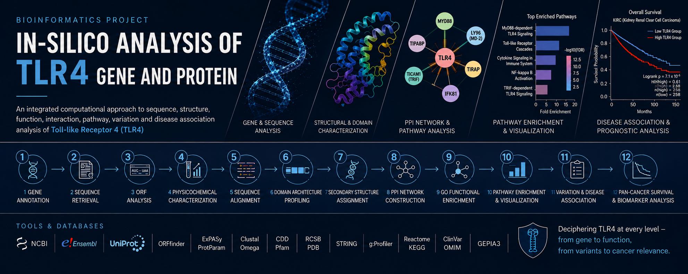
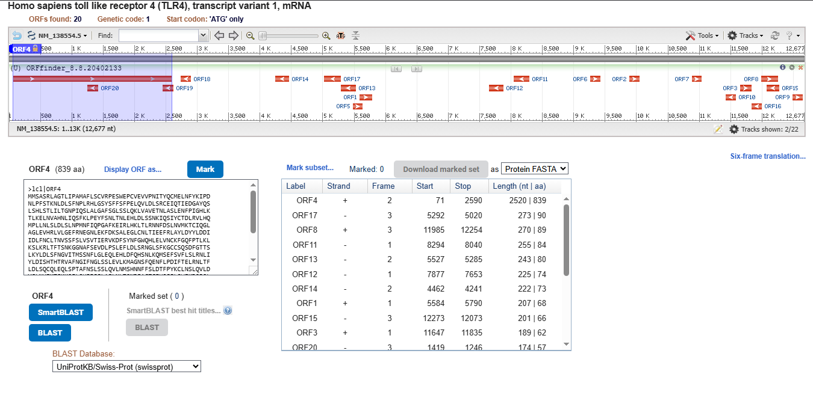
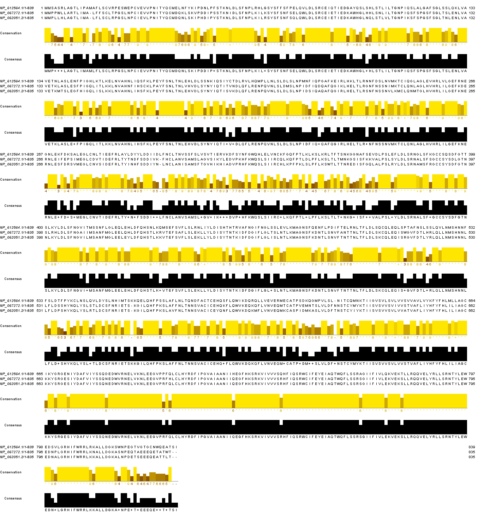
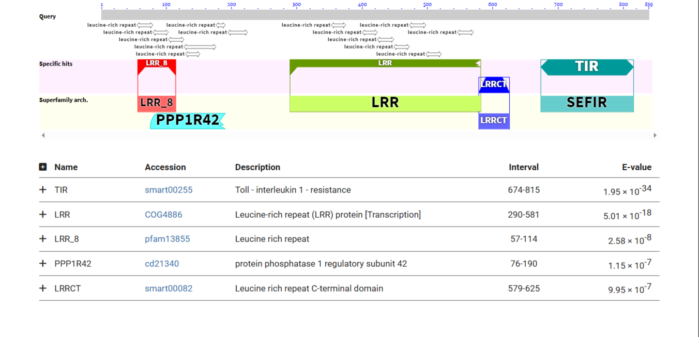
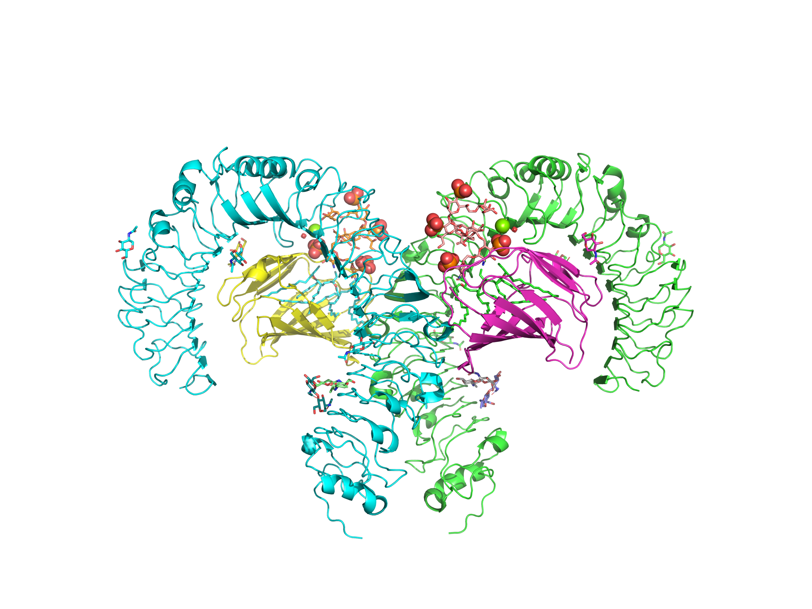
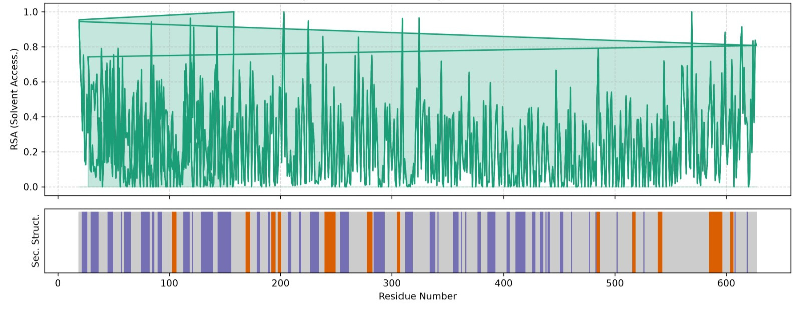
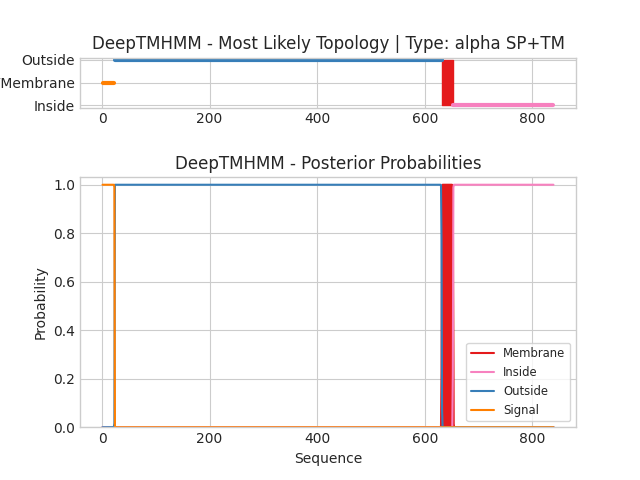
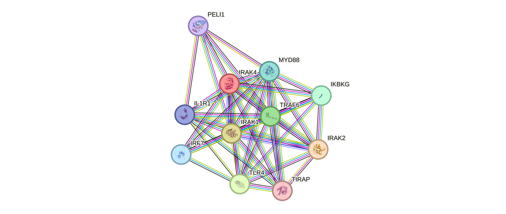
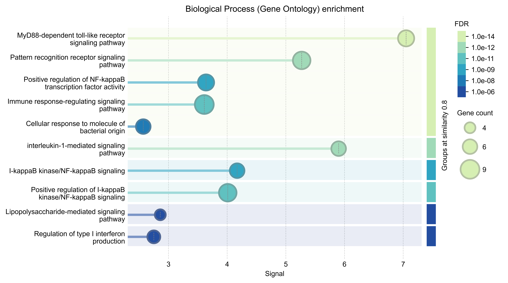

#   Human TLR4 In-Silico Analysis

A comprehensive computational study of the human TLR4 gene and protein, integrating sequence and structural characterization with evolutionary conservation, protein–protein interactions, functional and pathway enrichment, genetic variation, disease associations, and cancer prognostic analysis.
##  Project Overview

Toll-like receptor 4 (**TLR4**) is a pattern-recognition receptor that plays a central role in the innate immune response, particularly in the recognition of bacterial lipopolysaccharide (LPS). Activation of TLR4 initiates downstream signaling cascades involving adaptor proteins such as MYD88 and TICAM1 (TRIF), ultimately regulating inflammatory and immune-response genes.

This project presents an integrated **in-silico analysis of the human TLR4 gene and protein**, beginning with gene annotation and sequence retrieval and progressing through structural characterization, evolutionary conservation, protein–protein interaction analysis, functional and pathway enrichment, genomic variation, disease association, and pan-cancer survival analysis.

---
##  Objectives

- Annotate and characterize the human TLR4 gene.
- Retrieve and analyze TLR4 nucleotide and protein sequences.
- Identify and validate the coding region using ORF analysis.
- Characterize the physicochemical properties of TLR4 protein.
- Investigate evolutionary conservation using multiple sequence alignment.
- Identify conserved domains and functional regions.
- Analyze the secondary and three-dimensional structure of TLR4.
- Construct a TLR4 protein-protein interaction network.
- Perform Gene Ontology enrichment analysis.
- Identify enriched biological pathways.
- Investigate clinically relevant TLR4 genetic variants.
- Explore TLR4 expression and prognostic significance across cancers.

---
##  Workflow

1. Gene Annotation
2. Sequence Retrieval
3. ORF Analysis
4. Physicochemical Characterization
5. Multiple Sequence Alignment
6. Conserved Domain Architecture Profiling
7. Secondary Structure Assignment
8. Protein-Protein Interaction Network Construction
9. Gene Ontology Functional Enrichment
10. Pathway Enrichment & Visualization
11. Genomic Variation & Disease Association Mapping
12. Pan-Cancer Survival & Biomarker Profiling

---
##  Tools & Databases

| Analysis | Tool / Database |
|---|---|
| Gene Annotation | NCBI Gene, Ensembl, UniProtKB |
| Sequence Retrieval | NCBI Nucleotide, NCBI Protein, UniProtKB |
| ORF Analysis | NCBI ORFfinder |
| Physicochemical Analysis | ExPASy ProtParam |
| Multiple Sequence Alignment | Clustal Omega |
| Domain Analysis | NCBI CDD, Pfam |
| Structural Analysis | RCSB PDB |
| Protein Interaction | STRING |
| GO Enrichment | STRING, g:Profiler |
| Pathway Analysis | Reactome, KEGG, ShinyGO |
| Variant Analysis | ClinVar, OMIM, NCBI Variation Viewer |
| Cancer Analysis | GEPIA3 |

---

#  Analysis Results

## 1. Gene Annotation

Gene annotation was performed using NCBI Gene, Ensembl, and UniProtKB to determine the identity, chromosomal location, transcript information, protein information, and database cross-references of the human TLR4 gene.

### Target Gene Information

| Parameter | Information |
|---|---|
| Gene Symbol | TLR4 |
| Full Name | Toll-like receptor 4 |
| Organism | *Homo sapiens* |
| Chromosome | 9 |
| Chromosomal Locus | 9q33.1 |
| NCBI Gene ID | 7099 |
| RefSeq Transcript | NM_138554.5 |
| RefSeq Protein | NP_612564.1 |
| UniProt ID | O00206 |
| Protein Length | 839 amino acids |

---
## 2. Sequence Retrieval

The human TLR4 transcript and protein sequences were retrieved from NCBI and UniProtKB in FASTA format.

The retrieved sequences were subsequently used for ORF analysis, physicochemical characterization, evolutionary analysis, and structural investigation.
### Sequence Files

- [TLR4 mRNA sequence](data/TLR4_mRNA.fasta)
- [TLR4 protein sequence](data/TLR4_protein.fasta)

 ---
## 3. Open Reading Frame (ORF) Analysis

The TLR4 mRNA sequence was analyzed using NCBI ORFfinder across all six possible reading frames to identify and verify the protein-coding region.

The analysis identified the coding region corresponding to the full-length TLR4 precursor protein.

### ORF Analysis Result

- ORF: 4
- Reading Frame: +1
- Coding Sequence: approximately 2,520 bp
- Protein Length: 839 amino acids

**Figure 1:** NCBI ORFfinder analysis of human TLR4 transcript variant 1 (NM_138554.5), highlighting ORF 4 (2,520 bp / 839 aa, Frame +1) as the primary coding sequence

---
## 4. Physicochemical Characterization

The TLR4 protein sequence was analyzed using ExPASy ProtParam to determine its fundamental physicochemical properties.

The following parameters were investigated:

- Number of Amino Acids : 839
- Molecular weight : 95,680.13 Da (95.7 kDa)
- Theoretical isoelectric point (pI) : 5.88 (Slightly acidic)
- Highest Amino Acid : Leucine (L) at 15.5% (130 residues)
- Instability index : 43.05
- Aliphatic index : 101.86
- GRAVY hydropathicity score : 0.033
- Total number of negatively charged residues (Asp + Glu) : 83
- Total number of positively charged residues (Arg + Lys) : 68

  

### Total amino acid composition

- [TLR4 amino acid composition](data/TLR4_amino_acid_composition.csv)

---
## 5. Multiple Sequence Alignment & Evolutionary Conservation

Multiple sequence alignment (MSA) was performed to investigate the
evolutionary conservation of the human TLR4 protein across closely
related mammalian species. The protein sequences were retrieved from
NCBI Protein and aligned using **Clustal Omega (EMBL-EBI)**.
### Sequences Used

| Organism | Protein | Accession |
|---|---|---|
| *Homo sapiens* | TLR4 | `NP_612564.1` |
| *Mus musculus* | TLR4 | `NP_067272.1` |
| *Rattus norvegicus* | TLR4 | `NP_062051.2` |

In the Jalview alignment:

- `*` indicates an identical amino acid across the aligned sequences.
- `:` indicates a strongly conserved amino acid substitution.
- `.` indicates a weakly conserved substitution.
- Conserved regions may indicate evolutionary constraints associated
  with the structural or functional properties of TLR4.
### Files

- [Input Sequences](data/TLR4_orthologs.fa)
- [Clustal omega alignment](data/TLR4_MSA_human_mouse_rat.aln-clustal_num)
  

The resulting alignment was visualized using **Jalview** to examine
conserved and variable amino acid positions among the three TLR4
orthologs.

### Multiple Sequence Alignment

**Figure 2:** Multiple sequence alignment of human, mouse, and rat TLR4
proteins, generated using Clustal Omega and visualized using Jalview

### Interpretation

The alignment demonstrates substantial conservation among human,
mouse, and rat TLR4 sequences. Several regions contain highly conserved
amino acid residues, suggesting evolutionary preservation of important
structural and functional features of the receptor.

The observed conservation supports the use of mammalian TLR4 orthologs
for comparative analysis of the receptor and provides a basis for
identifying residues or regions that may be important for TLR4
structure and function.

---
## 6. Conserved Domain Architecture Profiling

Conserved domain analysis was performed using the NCBI Conserved Domain Database (CDD) and Pfam.

The TLR4 protein contains the following major structural regions:

- Extracellular leucine-rich repeat (LRR) region
- Transmembrane region
- Intracellular Toll/interleukin-1 receptor (TIR) domain

The extracellular LRR region contributes to ligand recognition, while the intracellular TIR domain participates in downstream signal transduction.

**Figure 3:** Conserved domain architecture of human TLR4 showing LRR and intracellular TIR domains

---
## 7. 3D Protein Structure Visualization

The three-dimensional structure of the human Toll-like receptor 4 (TLR4) protein was visualized using **PyMOL** to examine its overall structural organization and domain architecture.

The structure was rendered using a **cartoon representation**, with different structural regions/chains displayed in distinct colors. The visualization highlights the complex three-dimensional arrangement of TLR4 and its characteristic extracellular and membrane-associated structural organization.

### Visualization Tool
- **Software:** PyMOL
- **Representation:** Cartoon
- **Target:** Human TLR4 protein
- **Purpose:** Structural visualization and examination of the overall protein architecture

### TLR4 3D Structure

**Figure 4:** Three-dimensional structural visualization of human TLR4 generated using PyMOL.

---
## 8. Secondary Structure Analysis (DSSP)

The secondary structure of the TLR4 protein was analyzed using **DSSP (Define Secondary Structure of Proteins)** based on its three-dimensional structure.

DSSP was used to examine the distribution of secondary structural elements along the protein sequence, including **α-helices, β-strands, and loop/coil regions**. The analysis also included **relative solvent accessibility (RSA)** to assess the exposure of individual residues to the solvent.

### DSSP Analysis

**Figure 5:** DSSP-based analysis of TLR4 showing residue-wise relative solvent accessibility (RSA) and secondary structural assignments

###  Key Observations

- TLR4 contains a mixture of **α-helical, β-strand, and loop/coil regions**.
- The secondary structure elements are distributed throughout the protein rather than being confined to a single region.
- RSA values vary considerably across residues, indicating differences in **solvent exposure and structural environment**.
- Regions with higher RSA are more solvent-exposed, whereas residues with lower RSA are generally more buried within the protein structure.
- The DSSP profile provides additional structural information complementary to the three-dimensional structural analysis.

---
### 9. Membrane Topology Analysis — DeepTMHMM

Membrane topology of the human TLR4 protein was predicted using **DeepTMHMM** to identify signal peptides, transmembrane regions, and the predicted orientation of the protein relative to the membrane.

The analysis classified TLR4 as **alpha-helical Signal Peptide + Transmembrane (SP+TM)**.

#### Key observations

- An **N-terminal signal peptide** was predicted near the beginning of the sequence.
- A major **transmembrane α-helical region** was predicted near the C-terminal portion of the protein.
- The predicted topology places the majority of the TLR4 protein on the **extracellular side**, while the C-terminal region extends into the intracellular compartment.
- The posterior probability plot showed **high prediction confidence** for the major signal peptide and transmembrane regions.
- The predicted membrane topology is consistent with the known architecture of TLR4 as a **single-pass membrane receptor** with a large extracellular domain and a cytoplasmic TIR signaling domain.

###  DeepTMHMM Prediction

**Figure 6:** DeepTMHMM prediction of TLR4 membrane topology, showing the most likely topology and posterior probabilities for signal peptide, membrane, inside, and outside regions

---
## 10. Protein-Protein Interaction Network Construction

STRING was used to construct a functional protein-protein interaction network around TLR4.

Important interacting proteins include:

- MYD88
- CD14
- LY96 (MD-2)
- TIRAP
- TICAM1 (TRIF)
- IRF3
- NFKB1

These proteins represent important components of TLR4-mediated innate immune and inflammatory signaling.

**Figure 7:** STRING-based protein–protein interaction network of human TLR4 showing its functional associations with key innate immune signaling proteins, including MYD88, TIRAP, IRAK1/2/4, TRAF6, IRF7, and IKBKB

---
## 11. Gene Ontology Functional Enrichment

Gene Ontology enrichment analysis was performed using STRING and g:Profiler to characterize the TLR4 interaction network.

The analysis was performed across the three major Gene Ontology categories:

### Biological Process

- Response to lipopolysaccharide
- Innate immune response
- Inflammatory signaling
- Regulation of immune response

### Molecular Function

- Pattern recognition receptor activity
- Receptor activity
- Protein binding
- Signaling-related molecular functions

### Cellular Component

- Plasma membrane
- Cell surface
- Membrane-associated receptor complexes

**Figure 8:** Gene Ontology enrichment analysis of the TLR4-associated protein network, showing enriched functional categories based on statistical significance and gene count

---

  

